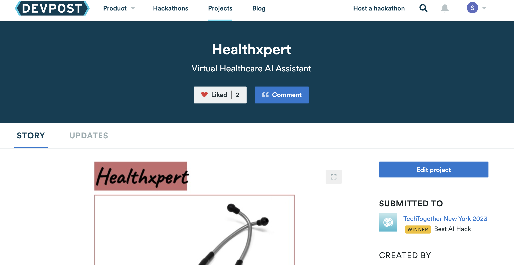
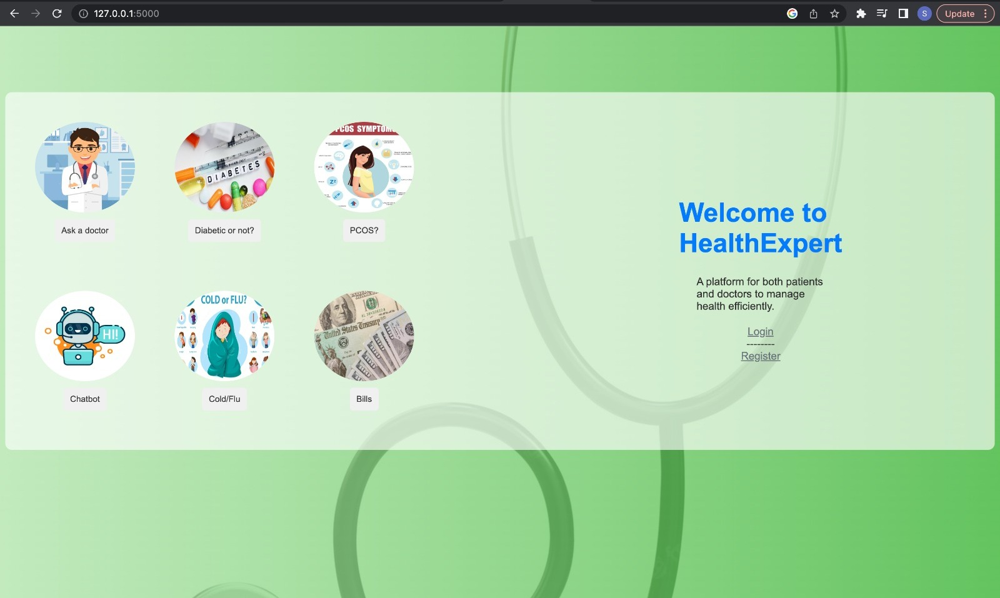
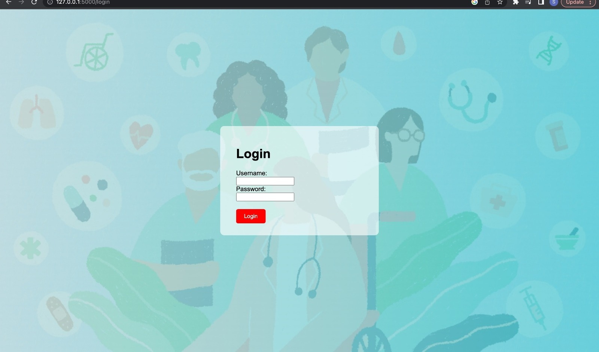

## Healthxpert
Constructed a web application featuring a chatbot capable of predicting 50+ diseases based on symptoms
Achieved 90% accuracy in predicting PCOS using image analysis techniques, hosted the application on Azure
Decision Tree and Logistic Regression

[Find the devpost link here: Healthxpert Virtual Healthcare AI Assistant](https://devpost.com/software/healthxpert-psq0yh)

## DevPost - TechTogether NewYork Hackathon May 2023
## Best AI Hack 

## Functionality

## Login Page

